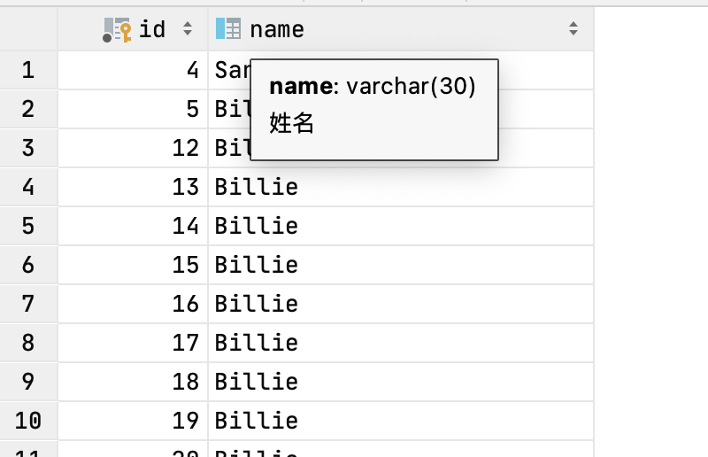
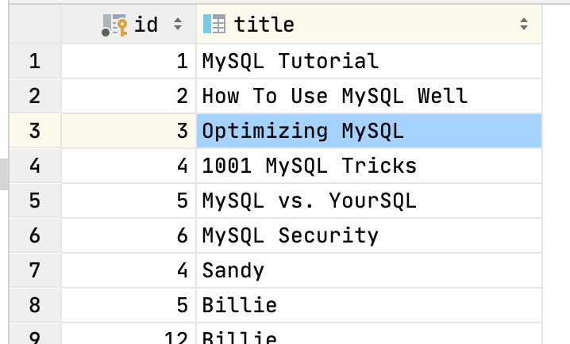

# cas-druid
    博客： https://www.cnblogs.com/ming-blogs/p/10288895.html

# 项目技术
    springboot2.0.X + gradle6.0+ + druid1.1.10

# 用到的表结构
```sql
create table if not exists user
(
	id bigint auto_increment comment '主键ID'
		primary key,
	name varchar(30) null comment '姓名',
	age int null comment '年龄',
	email varchar(50) null comment '邮箱',
	version int null comment '乐观锁',
	deleted int null,
	create_time datetime null comment '创建时间',
	update_time datetime null comment '更新时间'
);
-- 上面这张表和下面这张表不在同一个库中，关键是来测试多数据源的。

create table if not exists tcc_account.account
(
	id varchar(32) not null comment '主键ID'
		primary key,
	user_id varchar(128) not null comment '用户ID',
	balance decimal not null comment '用户余额',
	freeze_amount decimal not null comment '冻结金额，扣款暂存余额',
	create_time datetime not null,
	update_time datetime null
)
comment '账户余额表' collate=utf8mb4_bin;


```
    
# 项目结构
    applicaiton.yaml: 只测试druid和密码回调
        相关类：
            DbPasswordCallback.java
        
    application-uat.yaml: 多数据源配置
        相关类：
            TargetDataSource.java 主要用于在方法上使用注解，修改其调用的数据源
            CommonConstant.java   给数据源一个独有的标志
            DataSourceAspect.java 切面，切自定义注解然后将注解中的数据获取，从而选中其代表的数据源
            DynamicDataSource.java 较为核心的方法，其中determineCurrentLookupKey()方法最重要，返回的是数据源的标识，除了默认数据源，其他数据源
                                   以map形式保存，我们传入key就能获取其数据源对象。
            DynamicDataSourceConfig.java 这里我们获取我们配置的多数据源并放入数据源列表。
            
    注意：我们如果除了这个不配置其他的，我们会一个错误就是"循环依赖"，主要是因为数据源除了我们配置的，druid还有一个默认的数据源会加载，我们要将其禁止掉。
    在启动类上加如下代码：
    
    @Import({DynamicDataSourceConfig.class})
    @SpringBootApplication(exclude = { DataSourceAutoConfiguration.class })                      
    public class DruidApplication {
    
        public static void main(String[] args) {
            SpringApplication.run(DruidApplication.class, args);
        }
    
    }
    
# 读写分离
    思路：对每个方法要求，写的以add,update,delete开头，读的以query开头，然后用切面正则匹配。匹配之后用环绕通知对方法进行加强，改变其调用数据源


# 总结
    多数据源测试的时候，修改环境为uat
    @ConditionalOnBean（仅仅在当前上下文中存在某个对象时，才会实例化一个Bean）
    @ConditionalOnClass（某个class位于类路径上，才会实例化一个Bean）
    @ConditionalOnExpression（当表达式为true的时候，才会实例化一个Bean）
    @ConditionalOnMissingBean（仅仅在当前上下文中不存在某个对象时，才会实例化一个Bean）
    @ConditionalOnMissingClass（某个class类路径上不存在的时候，才会实例化一个Bean）
    @ConditionalOnNotWebApplication（不是web应用）
    @EnableConfigurationProperties
    如果一个配置类只配置@ConfigurationProperties注解，而没有使用@Component，那么在IOC容器中是获取不到properties 配置文件转化的bean。 
    @EnableConfigurationProperties 相当于把使用 @ConfigurationProperties 的类进行了一次注入。
    
## mybatis学习网站
    基础知识：http://c.biancheng.net/view/4320.html
    一级缓存：https://mp.weixin.qq.com/s?__biz=MzkwMDE1MzkwNQ==&mid=2247496101&idx=1&sn=8d32c975eb41744903bb6331a500c28d&source=41#wechat_redirect
    二级缓存：https://www.cnblogs.com/cxuanBlog/p/11333021.html


## 总结一些mysql的知识
    索引的分类与简述
    唯一索引：
        唯一索引与普通索引类似，不同的就是：索引列的值必须唯一，但允许有空值。如果是组合索引，则列值的组合必须唯一。
        简单来说：唯一索引是加速查询 + 列表唯一（可以有null）。以下几种方式来创建：
        1）、创建唯一索引
        ```sql```
        CREATE UNIQUE INDEX indexName ON table(column(length))
        
        2）、修改表结构
        ```sql```
        ALTER TABLE table_name ADD UNIQUE indexName ON (column(length))
        
    主键索引：
        主键索引是一种特殊的唯一索引，一个表只能有一个主键，不允许有空值。简单来说：主键索引是加速查询 + 列值唯一（不可以有null）+ 表中只有一个。
           一般是在建表的时候同时创建主键索引：
           ```sql```
           CREATE TABLE mytable( ID INT NOT NULL, username VARCHAR(16) NOT NULL, PRIMARY KEY(ID) );
           当然也可以用 ALTER 命令。记住：一个表只能有一个主键
    
    组合索引：
        组合索引指在多个字段上创建的索引，只有在查询条件中使用了创建索引时的第一个字段，索引才会被使用。使用组合索引时遵循最左前缀集合。
        可以说：组合索引是多列值组成一个索引，专门用于组合索引，其效率大于索引合并。
        ```sql```
        ALTER TABLE `table` ADD INDEX name_city_age (name,city,age);
        
    全文索引：
        全文索引主要用来查找文本中的关键字，而不是直接与索引中的值相比较。fulltext索引跟其他索引大不相同，它更像是一个搜索引擎，而不是简单的
        where语句的参数匹配。fulltext索引配合match against操作使用，而不是一般的where语句加like. 它可以在create table, alter table,
        create index使用， 不过目前只有char， varchar，text列上可以创建全文索引。值得一提的是，在数据量较大的时候，现将数据放入
        一个没有全文索引的表中，然后再用create index创建fulltext索引，要比先为一张表建立fulltext然后再将数据写入的速度快很多。
        1）、创建表的适合添加全文索引
         CREATE TABLE `table` (
             `id` int(11) NOT NULL AUTO_INCREMENT ,
             `title` char(255) CHARACTER NOT NULL ,
             `content` text CHARACTER NULL ,
             `time` int(10) NULL DEFAULT NULL ,
             PRIMARY KEY (`id`),
             FULLTEXT (content)
         );
         
         2）、修改表结构添加全文索引
         ALTER TABLE article ADD FULLTEXT index_content(content)
         
         3）、直接创建索引
         CREATE FULLTEXT INDEX index_content ON article(content)
         
         4）、全文索引案例
         #######################         #######################         #######################
         -- 初始化表结构
         CREATE TABLE articles (
                                   id INT UNSIGNED AUTO_INCREMENT NOT NULL PRIMARY KEY,
                                   title VARCHAR(200),
                                   body TEXT,
                                   FULLTEXT (title,body)
         ) ENGINE=InnoDB;
         
         -- 插入数据
         INSERT INTO articles (title,body) VALUES
         ('MySQL Tutorial','DBMS stands for DataBase ...'),
         ('How To Use MySQL Well','After you went through a ...'),
         ('Optimizing MySQL','In this tutorial we will show ...'),
         ('1001 MySQL Tricks','1. Never run mysqld as root. 2. ...'),
         ('MySQL vs. YourSQL','In the following database comparison ...'),
         ('MySQL Security','When configured properly, MySQL ...');
         
         
         -- 查询数据
         select * from articles  where match(title, body) AGAINST ('database' IN NATURAL LANGUAGE MODE );
         select * from articles  where match(title, body) AGAINST ('database');

         #######################         #######################         #######################
    
    聚簇索引：
        很简单记住一句话，找到了索引就找到了需要的数据，那么这个索引就是聚簇索引，所以主键就是聚簇索引，修改聚簇索引其实就是修改主键。
        当SQL查询的列就是索引本身时，我们称这种场景下该普通索引也可以叫做聚簇索引，MyisAM引擎没有聚簇索引
        【select no from student where no = 'test'】 这个时候no也是聚簇索引。
    
    非聚簇索引：
        索引的存储和数据的存储是分离的，也就是说找到了索引但没有找到数据，需要根据索引上的值（主键）再次回表查询，非聚簇索引也叫做辅助索引。
    
    一分钟明白MYSQL聚簇索引和非聚簇索引 【https://cloud.tencent.com/developer/article/1631424】

    MySQL 的覆盖索引与回表 【https://zhuanlan.zhihu.com/p/107125866】
    
### 演示索引优化
    初始化表
```sql
create table if not exists user
(
	id bigint auto_increment comment '主键ID'
		primary key,
	name varchar(30) null comment '姓名',
	age int null comment '年龄',
	email varchar(50) null comment '邮箱',
	version int null comment '乐观锁',
	deleted int null,
	create_time datetime null comment '创建时间',
	update_time datetime null comment '更新时间'
);

create index user_age_name_index
	on user (age, name);
```
    -- 不加age索引
    -- 1,SIMPLE,user,,ALL,,,,,20,10,Using where
    
    -- 加了索引【优化】
    -- 1,SIMPLE,user,,ref,user_age_index,user_age_index,5,const,1,100,Using index
    
    -- [不加组合索引，回表查询]：select id, age, name from user where age = 12
    -- 1,SIMPLE,user,,ref,user_age_index,user_age_index,5,const,1,100,null
    
    -- [加了组合索引]： select id, age, name from user where age = 12
    -- 1,SIMPLE,user,,ref,user_age_name_index,user_age_name_index,5,const,1,100,Using index
    -- 如果只有age的索引,查询列中包含name,则会从age这个非聚簇索引查询到id聚簇索引，然后通过回表通过id再查询name.效率底下，优化策略：建立组合索引（age, name）,删除age单索引，查询走索引不走回表，效率提升

    -- [分页查询优化]explain select id, age, name from user order by age limit 1,20;
    -- 加了age和name 的组合索引，sql会走index

    -- 待续....

### explain 【https://www.php.cn/mysql-tutorials-454417.html】
    * 表的读取顺序[id]
        id相同，执行顺序由上至下
        id不同，如果是子查询，id的序号会递增，id值越大优先级越高，越先被执行
    * 数据读取操作的操作类型[select_type]
        分别用来表示查询的类型，主要用于区别普通查询，联合查询，子查询等的复杂查询。
        SIMPLE 简单的select查询， 查询中不包含子查询或者UNION
        PRIMARY 查询中若 ·包含任何复杂的· 子部分，最外层查询则被标记为PRIMARY
        SUBQUERY 在SELECT或WHERE列表中包含了子查询
        DERIVED 在FORM 列表中包含的子查询被标记为DERIVED，MYSQL会递归执行这些子查询，把结果放在临时表中
        UNION若第二个SELECT出现在UNION之后，则被标记为UNION：若UNION包含在FROM子句的子查询中，外层SELECT将被标记为：DERIVED
        UNION RESULT 从UNION表获取结果的SELECT
    * 当前执行的表[table]
        tables  
    * 哪些索引可以使用[type]
        从最好的到最差的依次是： system > const > eq_ref > ref > range > index > all
        一般来说，得保证查询至少达到range级别，最好能达到ref
        * system 表只有一行记录（等于系统表），这是const类型的特例，平时不会出现，这个也可以忽略不计
        * const 表示通过索引一次就找到了，const用于比较primary key或者unique索引。因为只匹配一行数据，所以很快。
          如将主键置于where 列表中，Mysql就能将该查询转换为一个常量。
          1,SIMPLE,user,,const,PRIMARY,PRIMARY,8,const,1,100,
          explain select * from user where id = 4;
        * eq_ref 唯一性索引扫描,对于每个索引键，表中只有一条记录与之匹配。常见于主键或唯一索引扫描
        * ref 非唯一性索引扫描，返回匹配某个单独值的所有行，本质上也是一种索引访问，它返回所有匹配某个单独值的行，
          然而，它可能会找到多个符合条件的行，所以他应该属于查找和扫描的混合体。
        * range 只检索给定范围的行，使用一个索引来选择行，key列显示使用了哪个索引，一般就是在你的where语句中出现between、<、>、in等的查询，
        这种范围扫描索引比全表扫描要好，因为它只需要开始于索引的某一点，而结束于另一点，不用扫描全部索引。
        * index Full Index Scan, Index于ALL区别为index类型只遍历索引树。这通常比ALL快，因为索引文件通常比数据文件小。
        （也就是说虽然all和index都是读全表，但index是从索引中读取的，而all是从硬盘读取的）
        * all Full Table Scan将遍历全表以找到匹配的行   
    * 哪些索引被实际使用[possible_keys|key]
        possible_keys 显示可能应用在这张表中的索引，一个或多个。查询涉及到的字段上若存在索引，则该索引将被列出，但不一定被查询实际使用。
        key 实际使用的索引，如果为NULL，则没有使用索引。（可能原因包括没有建立索引或索引失效）
        查询中若使用了覆盖索引（select 后要查询的字段刚好和创建的索引字段完全相同），则该索引仅出现在key列表中
    * 表之间的引用[key_len]
        表示索引中使用的字节数，可通过该列计算查询中使用的索引的长度，在不损失精确性的情况下，长度越短越好。key_len显示的值为索引字段的最大可能长度，并非实际使用长度，即key_len是根据表定义计算而得，
        不是通过表内检索出的。
    * 每张表有多少行被优化器查询[ref]
        显示索引的那一列被使用了，如果可能的话，最好是一个常数。哪些列或常量被用于查找索引列上的值。
    * rows 
      根据表统计信息及索引选用情况，大致估算出找到所需的记录所需要读取的行数，也就是说，用的越少越好。
    * extra
      包含不适合在其他列中显式但十分重要的额外信息
      Using filesort（九死一生）
      说明mysql会对数据使用一个外部的索引排序，而不是按照表内的索引顺序进行读取。MySQL中无法利用索引完成的排序操作称为“文件排序”
      
      Using temporary（十死无生）
      使用了用临时表保存中间结果，MySQL在对查询结果排序时使用临时表。常见于排序order by和分组查询group by
      
      Using index（发财了）
      表示相应的select操作中使用了覆盖索引（Covering Index），避免访问了表的数据行，效率不错。如果同时出现using where，表明索引被用来执行索引键值的查找；如果没有同时出现using where，表明索引用来读取数据而非执行查找动作。

      Using where
      表明使用了where过滤

      Using join buffer
      表明使用了连接缓存,比如说在查询的时候，多表join的次数非常多，那么将配置文件中的缓冲区的join buffer调大一些。
      
      impossible where
      where子句的值总是false，不能用来获取任何元组

      distinct
      优化distinct操作，在找到第一匹配的元组后即停止找同样值的动作
   
### MySQL UNION 操作符
    select id, name from user union
    select id, title from articles;

    select id, title from articles union
    select id, name from user;

    
    
    

      
